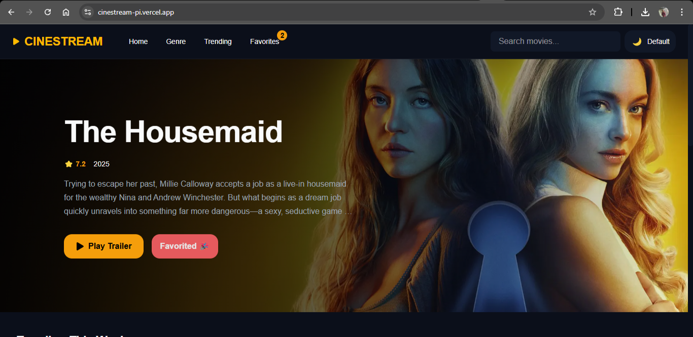
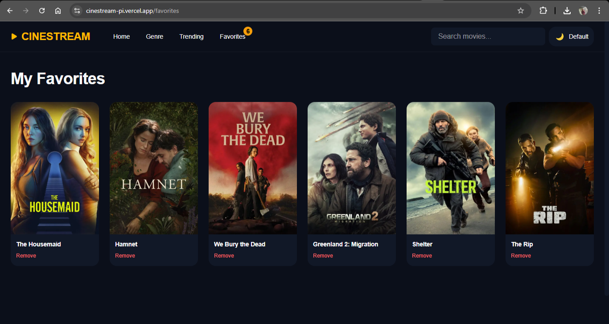
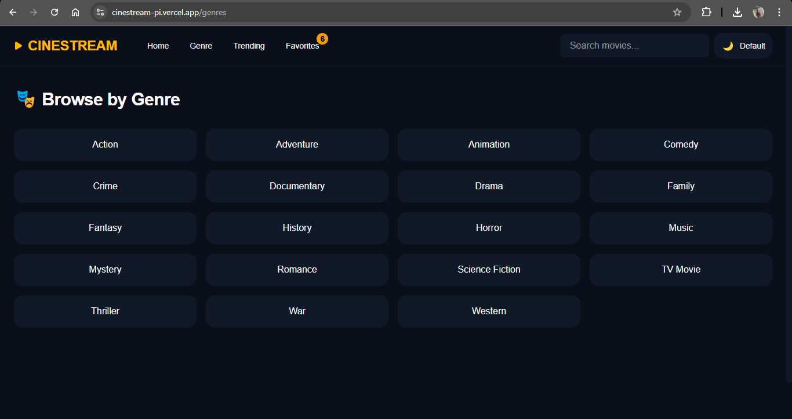
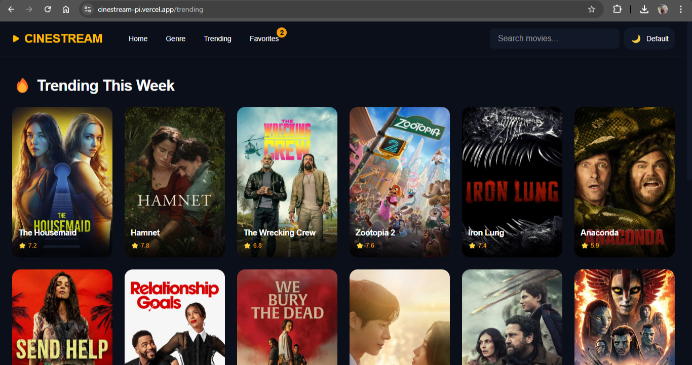

# 🎬 CineStream

CineStream is a modern, responsive movie discovery web app built with Next.js, TypeScript, and Tailwind CSS, powered by live data from The Movie Database (TMDB) API.

It focuses on performance, clean UI, and delightful micro-interactions — delivering a cinematic browsing experience right in the browser.

# ✨ Features

- 🎥 Trending Movies Dashboard
Discover what’s trending this week with a visually rich, responsive grid.

- 🌟 Hero Banner
A featured movie section with cinematic styling and smooth entrance animations.

- ❤️ Favorites System
Save and manage favorite movies using local storage (no auth required).

- 🧭 Genre Browsing
Explore movies by genre with dynamic TMDB-powered filtering.

- ⚡ Server-Side Rendering (SSR)
Fast initial load and SEO-friendly pages using Next.js Pages Router.

- 🎨 Modern UI & Micro-interactions
Subtle hover effects, transitions, and feedback for a premium feel.

- 📱 Fully Responsive
Optimized for mobile, tablet, and desktop screens.

# 🛠 Tech Stack

- Framework: Next.js (Pages Router)

- Language: TypeScript

- Styling: Tailwind CSS (latest)

- Data Source: TMDB API

- State Management: React Context

- Image Optimization: next/image with remotePatterns

- Deployment: Vercel

# 📸 Screenshots





# 🚀 Getting Started
1️⃣ Clone the repository
git clone https://github.com/dev-Darlington/cinestream.git
```bash
cd cinestream
```

2️⃣ Install dependencies
```bash
pnpm install
# or
npm install
# or
yarn install
```

3️⃣ Environment Variables

Create a .env.local file in the root directory:

TMDB_API_KEY=your_tmdb_api_key_here


You can get an API key from:
https://www.themoviedb.org/settings/api

4️⃣ Run the development server
```bash
pnpm run dev
```

Open http://localhost:3000
 to view the app.

 5️⃣ Build for production
 ```bash
pnpm run build
pnpm run start
```

## 📂 Project Structure

```md
```bash
cinestream/
├── components/
│   ├── section/        # Page-level sections (HeroBanner, dashboards)
│   └── ui/             # Reusable UI components (MovieCard, buttons)
├── contexts/           # Global state (FavoritesContext)
├── lib/                # External API and data-fetching logic (TMDB)
├── pages/              # Next.js Pages Router (routes & SSR)
├── styles/             # Global styles, themes, and Tailwind setup
├── types/              # TypeScript interfaces and models
├── public/             # Static assets (images, icons)
└── next.config.js      # Next.js configuration
```

## 🧠 Architectural Notes

- No authentication by design — favorites are client-side only

- Defensive API fetching to prevent SSR crashes

- Empty states instead of runtime failures

- Strict TypeScript typing with runtime safety

- No unnecessary animation libraries (performance-first)

## 🌱 Future Improvements

- 🔍 Advanced search with filters

- 🧩 Skeleton loaders for better perceived performance

- 🎭 Page transitions

- 🌙 Animated cinema-style theme switcher

- 🔐 Optional user authentication

- 📊 Recommendations based on favorites

## 🤝 Contributing

Contributions are welcome!

1. Fork the repo

2. Create a feature branch

3. Commit your changes

4. Open a pull request

## 📜 License

This project is open-source and available under the MIT License.

👋 Author

Darlington Nwanne
Software Developer

- GitHub: @dev-Darlington

- LinkedIn: https://www.linkedin.com/in/darlington-uc

